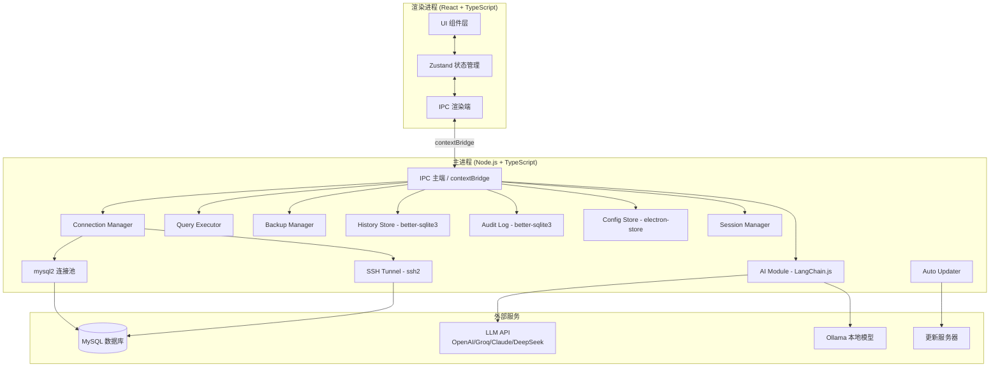
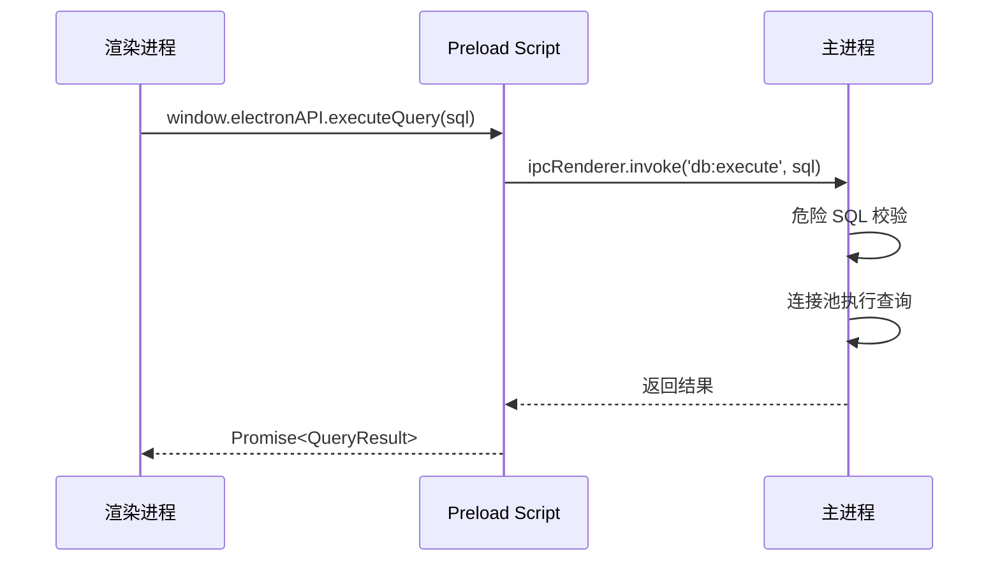

# 技术设计文档：DBForge AI

## 概述

DBForge AI 是一款基于 Electron 的跨平台桌面数据库管理工具，面向开发者、DBA、数据分析师和学生群体。应用采用 Electron + Vite + React + TypeScript 技术栈，通过严格的主进程/渲染进程分离架构保障数据安全，集成 AI Text-to-SQL 能力降低 SQL 编写门槛。

核心设计原则：
- **安全优先**：所有数据库操作在主进程执行，渲染进程通过 IPC 通信，启用 contextIsolation + sandbox
- **本地化**：无需服务器，所有数据（配置、历史、审计日志）存储在本地
- **AI 辅助**：SQL 生成必须经用户确认后方可执行，危险操作二次确认
- **高性能**：虚拟列表渲染大数据集，备份在独立子进程执行

---

## 架构

### 整体架构



### 进程通信架构

Electron 安全模型要求渲染进程不能直接访问 Node.js API。所有跨进程调用通过 `contextBridge` 暴露的 `window.electronAPI` 接口进行。



### 目录结构

```
electron-db-manager/
├── src/
│   ├── main/                    # 主进程
│   │   ├── index.ts             # 主进程入口
│   │   ├── ipc/                 # IPC 处理器注册
│   │   │   ├── connection.ts
│   │   │   ├── query.ts
│   │   │   ├── ai.ts
│   │   │   ├── backup.ts
│   │   │   └── settings.ts
│   │   ├── services/            # 业务服务
│   │   │   ├── ConnectionManager.ts
│   │   │   ├── QueryExecutor.ts
│   │   │   ├── AIModule.ts
│   │   │   ├── BackupManager.ts
│   │   │   ├── HistoryStore.ts
│   │   │   ├── AuditLog.ts
│   │   │   ├── ConfigStore.ts
│   │   │   ├── SessionManager.ts
│   │   │   ├── SSHTunnel.ts
│   │   │   └── AutoUpdater.ts
│   │   └── preload.ts           # Preload 脚本
│   ├── renderer/                # 渲染进程
│   │   ├── main.tsx             # React 入口
│   │   ├── App.tsx
│   │   ├── components/          # UI 组件
│   │   │   ├── ConnectionPanel/
│   │   │   ├── SchemaBrowser/
│   │   │   ├── SQLEditor/
│   │   │   ├── ResultPanel/
│   │   │   ├── AIPanel/
│   │   │   ├── TabManager/
│   │   │   ├── BackupDialog/
│   │   │   └── Settings/
│   │   ├── store/               # Zustand 状态
│   │   │   ├── connectionStore.ts
│   │   │   ├── editorStore.ts
│   │   │   ├── resultStore.ts
│   │   │   └── settingsStore.ts
│   │   └── hooks/               # 自定义 Hooks
│   └── shared/                  # 主/渲染进程共享类型
│       └── types.ts
├── electron.vite.config.ts
├── electron-builder.yml
└── package.json
```

---

## 组件与接口

### 1. Connection Manager（连接管理器）

负责连接配置的 CRUD、连接池生命周期管理、SSH 隧道建立。

```typescript
interface ConnectionConfig {
  id: string;
  name: string;
  groupId?: string;
  host: string;
  port: number;
  username: string;
  password: string;          // 存储时加密
  database?: string;
  ssl?: SSLConfig;
  ssh?: SSHTunnelConfig;
  createdAt: number;
  updatedAt: number;
}

interface SSHTunnelConfig {
  enabled: boolean;
  host: string;
  port: number;
  username: string;
  authType: 'password' | 'privateKey';
  password?: string;         // 存储时加密
  privateKeyPath?: string;
  localPort?: number;        // 自动分配
}

interface ConnectionGroup {
  id: string;
  name: string;
  order: number;
}

interface ConnectionStatus {
  id: string;
  state: 'connected' | 'disconnected' | 'connecting' | 'error';
  error?: string;
  latency?: number;
}

class ConnectionManager {
  async createConnection(config: ConnectionConfig): Promise<void>
  async testConnection(config: ConnectionConfig): Promise<TestResult>
  async activateConnection(id: string): Promise<void>
  async deactivateConnection(id: string): Promise<void>
  async getConnectionStatus(id: string): Promise<ConnectionStatus>
  async exportConnections(ids: string[]): Promise<string>  // JSON，密码脱敏
  async importConnections(json: string): Promise<ConnectionConfig[]>
  getPool(connectionId: string): mysql2.Pool
}
```

### 2. Query Executor（查询执行器）

在主进程中安全执行 SQL，支持取消、超时、危险 SQL 检测。

```typescript
interface QueryOptions {
  connectionId: string;
  sql: string;
  timeout?: number;          // 默认 30000ms
  abortSignal?: AbortSignal;
}

interface QueryResult {
  columns: ColumnMeta[];
  rows: Record<string, unknown>[];
  affectedRows?: number;
  executionTime: number;     // ms
  sql: string;
}

interface ColumnMeta {
  name: string;
  type: string;
  nullable: boolean;
}

class QueryExecutor {
  async execute(options: QueryOptions): Promise<QueryResult>
  async cancel(queryId: string): Promise<void>
  isDangerous(sql: string): DangerousCheckResult
}

interface DangerousCheckResult {
  isDangerous: boolean;
  reasons: string[];         // e.g. ['包含 DROP TABLE', '无 WHERE 子句的 DELETE']
}
```

### 3. AI Module（AI 模块）

基于 LangChain.js 封装多 LLM 提供商，实现 Text-to-SQL。

```typescript
interface AIConfig {
  provider: 'openai' | 'groq' | 'claude' | 'deepseek' | 'ollama';
  apiKey?: string;           // 加密存储
  model: string;
  temperature: number;       // 0-1
  baseUrl?: string;          // Ollama 本地地址
  mode: 'readonly' | 'full';
}

interface TextToSQLRequest {
  naturalLanguage: string;
  schema: DatabaseSchema;
  connectionId: string;
}

interface TextToSQLResponse {
  sql: string;
  explanation: string;       // 自然语言解释
  isDangerous: boolean;
  provider: string;
  model: string;
  latency: number;
}

class AIModule {
  async textToSQL(request: TextToSQLRequest): Promise<TextToSQLResponse>
  async explainResult(result: QueryResult, question?: string): Promise<string>
  async switchProvider(config: AIConfig): Promise<void>
}
```

### 4. Schema Browser（Schema 浏览器）

获取并缓存数据库结构信息，供 AI 模块和编辑器自动补全使用。

```typescript
interface DatabaseSchema {
  connectionId: string;
  databases: DatabaseInfo[];
  fetchedAt: number;
}

interface DatabaseInfo {
  name: string;
  tables: TableInfo[];
}

interface TableInfo {
  name: string;
  columns: ColumnInfo[];
  primaryKeys: string[];
  foreignKeys: ForeignKeyInfo[];
  rowCount?: number;
}

interface ColumnInfo {
  name: string;
  type: string;
  nullable: boolean;
  defaultValue?: string;
  comment?: string;
}
```

### 5. Backup Manager（备份管理器）

通过 `child_process` 调用 mysqldump，在独立子进程中执行备份/恢复。

```typescript
interface BackupOptions {
  connectionId: string;
  databases: string[];
  outputPath: string;
  compress: boolean;
  options: {
    singleTransaction: boolean;
    routines: boolean;
    triggers: boolean;
  };
}

interface BackupProgress {
  phase: 'preparing' | 'dumping' | 'compressing' | 'done' | 'error';
  percent: number;
  message: string;
  filePath?: string;
  fileSize?: number;
  duration?: number;
}

class BackupManager {
  async detectMysqldump(): Promise<string | null>
  async validateMysqldumpPath(path: string): Promise<boolean>
  async backup(options: BackupOptions, onProgress: (p: BackupProgress) => void): Promise<string>
  async restore(connectionId: string, filePath: string, onProgress: (p: BackupProgress) => void): Promise<void>
  async openBackupFolder(filePath: string): Promise<void>
}
```

### 6. History Store & Audit Log

两个独立的 better-sqlite3 数据库，分别存储查询历史和审计日志。

```typescript
interface QueryHistory {
  id: number;
  connectionId: string;
  connectionName: string;
  sql: string;
  executedAt: number;
  duration: number;          // ms
  rowCount: number;
  success: boolean;
}

interface AuditEntry {
  id: number;
  connectionId: string;
  connectionName: string;
  sql: string;
  executedAt: number;
  result: 'success' | 'failure';
  affectedRows: number;
  errorMessage?: string;
}
```

### 7. IPC Channel 定义

所有 IPC 通道名称集中定义，避免魔法字符串。

```typescript
// shared/ipc-channels.ts
export const IPC = {
  // 连接管理
  CONNECTION_LIST:    'connection:list',
  CONNECTION_CREATE:  'connection:create',
  CONNECTION_UPDATE:  'connection:update',
  CONNECTION_DELETE:  'connection:delete',
  CONNECTION_TEST:    'connection:test',
  CONNECTION_ACTIVATE:'connection:activate',
  CONNECTION_STATUS:  'connection:status',
  CONNECTION_EXPORT:  'connection:export',
  CONNECTION_IMPORT:  'connection:import',

  // Schema
  SCHEMA_FETCH:       'schema:fetch',
  SCHEMA_REFRESH:     'schema:refresh',

  // 查询
  QUERY_EXECUTE:      'query:execute',
  QUERY_CANCEL:       'query:cancel',
  QUERY_DANGEROUS_CHECK: 'query:dangerous-check',

  // AI
  AI_TEXT_TO_SQL:     'ai:text-to-sql',
  AI_EXPLAIN_RESULT:  'ai:explain-result',
  AI_CONFIG_SAVE:     'ai:config-save',

  // 备份
  BACKUP_DETECT_TOOL: 'backup:detect-tool',
  BACKUP_START:       'backup:start',
  BACKUP_RESTORE:     'backup:restore',
  BACKUP_PROGRESS:    'backup:progress',   // 主进程推送

  // 历史 & 审计
  HISTORY_LIST:       'history:list',
  HISTORY_SEARCH:     'history:search',
  HISTORY_CLEAR:      'history:clear',
  AUDIT_LIST:         'audit:list',
  AUDIT_EXPORT:       'audit:export',

  // 设置
  SETTINGS_GET:       'settings:get',
  SETTINGS_SET:       'settings:set',

  // 会话
  SESSION_EXTEND:     'session:extend',
  SESSION_LOCK:       'session:lock',      // 主进程推送

  // 更新
  UPDATER_CHECK:      'updater:check',
  UPDATER_DOWNLOAD:   'updater:download',
  UPDATER_STATUS:     'updater:status',    // 主进程推送
} as const;
```

---

## 数据模型

### Config Store（electron-store）

存储应用配置，密码和 API Key 字段使用 `safeStorage.encryptString` 加密。

```typescript
interface AppConfig {
  // AI 配置
  ai: {
    provider: AIConfig['provider'];
    model: string;
    temperature: number;
    apiKeyEncrypted?: string;   // safeStorage 加密
    baseUrl?: string;
    mode: 'readonly' | 'full';
  };

  // 连接配置（密码加密）
  connections: Array<ConnectionConfig & { passwordEncrypted: string }>;
  connectionGroups: ConnectionGroup[];

  // 外观
  theme: 'system' | 'light' | 'dark';
  language: 'zh' | 'en';

  // 快捷键
  shortcuts: Record<string, string>;

  // 备份
  mysqldumpPath?: string;
  autoBackup: boolean;
  autoBackupInterval: number;  // 分钟

  // 会话
  sessionTimeout: number;      // 分钟，0 = 从不

  // 历史
  historyLimit: number;        // 默认 1000

  // 审计日志
  auditRetentionDays: number;  // 默认 90

  // 崩溃报告
  crashReportEnabled: boolean;

  // 首次启动
  onboardingCompleted: boolean;

  // 版本
  version: string;
}
```

### History DB（better-sqlite3）

```sql
-- query_history 表
CREATE TABLE query_history (
  id           INTEGER PRIMARY KEY AUTOINCREMENT,
  connection_id   TEXT NOT NULL,
  connection_name TEXT NOT NULL,
  sql          TEXT NOT NULL,
  executed_at  INTEGER NOT NULL,  -- Unix timestamp ms
  duration     INTEGER NOT NULL,  -- ms
  row_count    INTEGER NOT NULL DEFAULT 0,
  success      INTEGER NOT NULL DEFAULT 1  -- 0/1
);

CREATE INDEX idx_history_connection ON query_history(connection_id);
CREATE INDEX idx_history_executed_at ON query_history(executed_at DESC);
```

### Audit DB（better-sqlite3）

```sql
-- audit_log 表
CREATE TABLE audit_log (
  id              INTEGER PRIMARY KEY AUTOINCREMENT,
  connection_id   TEXT NOT NULL,
  connection_name TEXT NOT NULL,
  sql             TEXT NOT NULL,
  executed_at     INTEGER NOT NULL,
  result          TEXT NOT NULL CHECK(result IN ('success', 'failure')),
  affected_rows   INTEGER NOT NULL DEFAULT 0,
  error_message   TEXT
);

CREATE INDEX idx_audit_connection ON audit_log(connection_id);
CREATE INDEX idx_audit_executed_at ON audit_log(executed_at DESC);
```

### Snippets DB（better-sqlite3）

```sql
-- sql_snippets 表
CREATE TABLE sql_snippets (
  id          INTEGER PRIMARY KEY AUTOINCREMENT,
  title       TEXT NOT NULL,
  sql         TEXT NOT NULL,
  tags        TEXT,            -- JSON 数组
  created_at  INTEGER NOT NULL,
  updated_at  INTEGER NOT NULL
);
```

---

## 正确性属性

*属性（Property）是在系统所有有效执行中都应成立的特征或行为——本质上是对系统应做什么的形式化陈述。属性是人类可读规范与机器可验证正确性保证之间的桥梁。*


### 属性 1：连接配置序列化往返

*对于任意* 有效的连接配置对象（含主机、端口、用户名、数据库名等非敏感字段），将其保存到 Config Store 后再读取，所有非加密字段应与原始值完全一致。

**验证需求：1.1**

### 属性 2：密码加密往返

*对于任意* 密码字符串，加密后的存储值不应等于原始明文，且对加密值解密后应还原为原始密码（`decrypt(encrypt(p)) == p`）。

**验证需求：1.3, 9.3, 10.5**

### 属性 3：连接导出时密码脱敏

*对于任意* 包含密码的连接配置集合，导出的 JSON 字符串中不应包含任何原始明文密码。

**验证需求：1.7**

### 属性 4：连接导入导出往返

*对于任意* 连接配置集合，导出后再导入，所有非敏感字段（主机、端口、用户名、数据库名、分组等）应与原始值完全一致。

**验证需求：1.7, 1.8**

> 注：属性 3 和属性 4 互补——属性 3 验证安全性，属性 4 验证完整性。两者不冗余。

### 属性 5：AI Prompt 包含完整 Schema

*对于任意* 数据库 Schema（含若干表和字段），构建的 AI Prompt 字符串应包含所有表名和字段名，确保 LLM 拥有完整上下文。

**验证需求：3.1**

### 属性 6：只读模式仅生成 SELECT

*对于任意* 自然语言输入（包括明确要求写操作的描述），在 Read_Only_Mode 下，AI 模块返回的 SQL 经解析后应只包含 SELECT 语句，不含任何 INSERT / UPDATE / DELETE / DROP / ALTER / TRUNCATE 等操作。

**验证需求：3.3, 10.4**

> 注：需求 3.3（AI 层）和 10.4（执行层）均要求只读模式拒绝写操作，属性 6 覆盖 AI 生成层，属性 10 覆盖执行层，两者不冗余。

### 属性 7：AI 响应结构完整性

*对于任意* 有效的 Text-to-SQL 请求，AI 模块的响应应同时包含非空的 `sql` 字段和非空的 `explanation` 字段。

**验证需求：3.5**

### 属性 8：SQL 格式化幂等性

*对于任意* SQL 字符串，对其格式化两次的结果应与格式化一次的结果相同（`format(format(sql)) == format(sql)`）。

**验证需求：4.3**

### 属性 9：自动补全包含 Schema 中所有标识符

*对于任意* 数据库 Schema，编辑器的自动补全建议列表应包含该 Schema 中所有的表名和字段名。

**验证需求：4.2**

### 属性 10：只读模式拒绝执行非 SELECT SQL

*对于任意* 非 SELECT 类型的 SQL 语句（INSERT / UPDATE / DELETE / DROP / ALTER / TRUNCATE 等），在 Read_Only_Mode 下，Query Executor 应拒绝执行并返回错误，不向数据库发送该语句。

**验证需求：10.4**

### 属性 11：危险 SQL 检测覆盖所有变体

*对于任意* 包含 DROP、TRUNCATE 或无 WHERE 子句的 DELETE 语句（包括不同大小写、多余空白字符、SQL 注释等变体），危险 SQL 检测函数应返回 `isDangerous: true`。

**验证需求：5.7, 10.3**

### 属性 12：结果集排序不变量

*对于任意* 查询结果集和任意列，按该列升序排序后，相邻行的该列值应满足 `row[i][col] <= row[i+1][col]`；按降序排序后应满足 `row[i][col] >= row[i+1][col]`。

**验证需求：5.2**

### 属性 13：结果集导出往返

*对于任意* 查询结果集，将其导出为 CSV 或 JSON 格式后解析，所有行和列的数据应与原始结果集完全一致（数值类型保持语义等价）。

**验证需求：5.3**

### 属性 14：查询历史记录完整性

*对于任意* SQL 执行操作，执行完成后，历史记录中应包含一条包含完整元数据（SQL 内容、执行时间、耗时、返回行数、连接名）的记录。

**验证需求：6.1, 19.1**

> 注：需求 6.1（查询历史）和 19.1（审计日志）均要求记录完整信息，但存储在不同的表中。属性 14 覆盖历史记录，属性 15 覆盖审计日志，两者不冗余。

### 属性 15：审计日志记录完整性

*对于任意* SQL 执行操作（成功或失败），审计日志中应包含一条包含所有必需字段（执行时间、连接名、SQL 内容、执行结果、影响行数）的条目，且该条目与历史记录分开存储。

**验证需求：19.1, 19.2**

### 属性 16：历史记录搜索结果一致性

*对于任意* 关键词和历史记录集合，搜索返回的每条记录都应包含该关键词（在 SQL 内容或连接名中），且所有包含该关键词的记录都应出现在结果中（无遗漏）。

**验证需求：6.2**

### 属性 17：历史记录数量上限不变量

*对于任意* 配置的历史记录上限值，在任意时刻，历史记录的总数不应超过该上限值。

**验证需求：6.4**

### 属性 18：审计日志保留策略不变量

*对于任意* 配置的保留天数，执行清理操作后，审计日志中不应存在 `executed_at` 早于保留截止时间的条目。

**验证需求：19.5**

### 属性 19：mysqldump 路径探测正确性

*对于任意* 包含若干路径的候选列表（其中部分路径存在且有效），路径探测函数应返回列表中第一个有效的 mysqldump 可执行文件路径，且不返回不存在的路径。

**验证需求：8.1**

### 属性 20：SQL 片段保存往返

*对于任意* SQL 片段（含标题和 SQL 内容），保存后通过 ID 查询，应得到与原始片段完全一致的内容。

**验证需求：4.6**

---

## 错误处理

### 错误分类与处理策略

| 错误类型 | 来源 | 处理方式 | 用户提示 |
|---------|------|---------|---------|
| 数据库连接失败 | mysql2 | 捕获错误码，映射到友好说明 | 错误码 + 常见原因 + 排查建议 |
| SQL 执行失败 | mysql2 | 解析错误位置，高亮错误行 | MySQL 原始错误 + 友好说明 |
| LLM 调用失败 | LangChain.js | 捕获网络/API 错误 | 错误原因 + 重试按钮 + 切换模型 |
| SSH 隧道失败 | ssh2 | 捕获 SSH 错误码 | SSH 错误信息 + 排查建议 |
| 备份/恢复失败 | child_process | 捕获 stderr，保留完整日志 | 失败原因 + 解决建议 |
| 文件系统错误 | Node.js fs | 捕获 ENOENT/EACCES 等 | 友好说明 |
| 应用崩溃 | Electron | Crash Reporter 收集堆栈 | 重启提示（用户授权后上报） |

### 错误处理原则

1. **不白屏**：所有未捕获异常在主进程和渲染进程均有全局错误边界（React Error Boundary + `process.on('uncaughtException')`）
2. **不泄露敏感信息**：错误日志中自动过滤密码、API Key 等敏感字段
3. **可恢复**：所有错误提示均提供明确的下一步操作（重试、切换、手动配置等）
4. **日志完整**：错误详情写入应用日志文件，用户可在设置页面查看

### IPC 错误传递

主进程的错误通过 IPC 返回时，统一使用以下结构：

```typescript
interface IPCError {
  code: string;          // 错误码，如 'DB_CONNECTION_FAILED'
  message: string;       // 技术错误信息
  userMessage: string;   // 用户友好说明
  suggestions?: string[];// 排查建议
  details?: unknown;     // 原始错误详情（不含敏感信息）
}
```

---

## 测试策略

### 测试层次

本项目采用双轨测试策略：**单元/属性测试**（验证业务逻辑正确性）+ **集成测试**（验证外部依赖交互）。

#### 属性测试（Property-Based Testing）

使用 [fast-check](https://github.com/dubzzz/fast-check) 作为属性测试库（TypeScript 原生支持，生态成熟）。

每个属性测试配置最少 **100 次迭代**，通过随机生成输入覆盖边界情况。

测试标签格式：`Feature: electron-db-manager, Property {N}: {属性描述}`

适用于以下模块的纯函数逻辑：
- `ConfigStore`：加密/解密往返（属性 2）
- `ConnectionManager`：导出脱敏（属性 3）、导入导出往返（属性 4）
- `AIModule`：Prompt 构建（属性 5）、只读模式过滤（属性 6）、响应结构（属性 7）
- `QueryExecutor`：危险 SQL 检测（属性 11）、只读模式拒绝（属性 10）
- `SQLFormatter`：格式化幂等性（属性 8）
- `SchemaCompletion`：补全覆盖性（属性 9）
- `ResultPanel`：排序不变量（属性 12）、导出往返（属性 13）
- `HistoryStore`：历史完整性（属性 14）、搜索一致性（属性 16）、数量上限（属性 17）
- `AuditLog`：审计完整性（属性 15）、保留策略（属性 18）
- `BackupManager`：路径探测（属性 19）
- `SnippetStore`：片段往返（属性 20）

示例属性测试结构：

```typescript
// Feature: electron-db-manager, Property 11: 危险 SQL 检测覆盖所有变体
import fc from 'fast-check';
import { isDangerousSQL } from '../services/QueryExecutor';

test('危险 SQL 检测 - DROP 语句各种变体', () => {
  fc.assert(
    fc.property(
      fc.constantFrom('drop', 'DROP', 'Drop', 'dRoP'),
      fc.string({ minLength: 1 }),
      (keyword, tableName) => {
        const sql = `${keyword} TABLE ${tableName}`;
        const result = isDangerousSQL(sql);
        return result.isDangerous === true;
      }
    ),
    { numRuns: 100 }
  );
});
```

#### 单元测试（Example-Based）

使用 **Vitest** 作为测试框架，覆盖：
- 具体的错误场景（LLM 失败、连接失败）
- UI 交互行为（快捷键触发、状态切换）
- 边界条件（空输入、超长 SQL、特殊字符）

#### 集成测试

使用 **Vitest + testcontainers**（Docker 启动 MySQL 实例）覆盖：
- 数据库连接与查询执行
- Schema 获取
- 备份/恢复流程（需要 mysqldump 工具）
- SSH 隧道连接

#### E2E 测试

使用 **Playwright** 覆盖关键用户流程：
- 首次启动引导流程
- 添加连接 → 执行查询 → 查看结果
- AI Text-to-SQL 完整流程
- 备份操作流程

### 不适用属性测试的场景

以下场景**不使用**属性测试，原因如下：

| 场景 | 原因 | 替代方案 |
|------|------|---------|
| UI 渲染（React 组件） | 无法量化"正确渲染"的通用属性 | 快照测试 + 视觉回归测试 |
| 数据库连接/查询 | 依赖外部 MySQL 服务，100 次迭代成本高 | 集成测试（1-3 个示例） |
| LLM API 调用 | 依赖外部服务，成本高且不确定 | Mock 测试 + 集成测试 |
| 备份/恢复操作 | 依赖 mysqldump 工具和文件系统 | 集成测试 |
| 自动更新 | 依赖更新服务器 | Mock 测试 |
| 崩溃报告 | 一次性配置检查 | Smoke 测试 |
