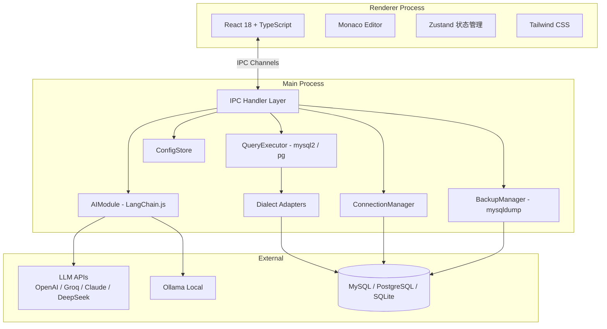

# DBForge AI

<div align="center">

**跨平台桌面数据库管理工具 · AI 驱动的智能 SQL 助手**

[](./LICENSE)
[](https://electronjs.org/)
[](https://react.dev/)
[](https://www.typescriptlang.org/)

</div>

---

## 简介

DBForge AI 是一款现代化桌面数据库管理工具，为**开发者**、**DBA** 和**数据分析师**设计。它将专业级 SQL 编辑体验与 AI 大语言模型深度整合，让您用自然语言即可完成复杂的数据查询与分析。

> **核心哲学：自然语言 → SQL → 人工确认 → 安全执行**，在效率与安全之间取得最优平衡。

### 为什么选择 DBForge AI？

| 对比维度 | DBForge AI | DBeaver | TablePlus | Navicat |
|----------|------------|---------|-----------|---------|
| AI Text-to-SQL | ✅ 多模型 | ❌ 需插件 | ❌ | ❌ |
| 多数据库支持 | ✅ 5 种 | ✅ | ✅ | ✅ |
| 数据行内编辑 | ✅ AI 辅助 | ✅ | ✅ | ✅ |
| 完全本地化 | ✅ 数据不出机 | ✅ | ✅ | ✅ |
| 开源免费 | ✅ MIT | ✅ | ❌ 付费 | ❌ 付费 |
| SQL 安全审计 | ✅ AI 驱动 | ❌ | ❌ | ❌ |
| 跨平台 | ✅ Win/Mac/Linux | ✅ | ✅ | ✅ |

---

## 核心功能

### 🤖 AI 智能助手

内置 **8 大 AI 能力**，覆盖 SQL 开发全流程：

| 功能 | 说明 | 典型场景 |
|------|------|----------|
| **Text-to-SQL** | 自然语言 → SQL 查询 | *"查询上个月销售额前 10 的产品及其分类名称"* |
| **SQL 解释** | 对任意 SQL 进行中文解读 | 接手他人代码时快速理解业务逻辑 |
| **查询优化** | 分析执行计划，给出索引和改写建议 | 慢查询定位与优化 |
| **错误诊断** | 粘贴报错信息，AI 定位根因 | `ERROR 1064: You have an error in your SQL syntax...` |
| **安全审计** | 检测注入风险、危险操作、权限越界 | 上线前 SQL 审查 |
| **Schema 文档** | 一键生成 Markdown 数据库文档 | 新人入职、技术交接 |
| **数据质量分析** | 识别空值率、重复值、异常值 | 数据清洗前的质量评估 |
| **结果洞察** | 对查询结果集进行自然语言摘要 | 快速提炼数据报告关键结论 |

#### 支持的 AI 提供商

| 提供商 | 类型 | 说明 |
|--------|------|------|
| **OpenAI** | 云端 API | GPT-4o / GPT-4-turbo，综合能力最强 |
| **Groq** | 云端 API | LPU 推理引擎，极速响应 (< 1s) |
| **Claude** | 云端 API | Anthropic，擅长长文本与安全性 |
| **DeepSeek** | 云端 API | 高性价比，中文理解优秀 |
| **Ollama** | 本地部署 | 完全离线，数据零出机，推荐 `deepseek-coder` / `qwen2.5` |

#### AI 双模式

- **🔒 只读模式**（默认） — AI 仅生成 `SELECT` 语句，适合数据分析师和新手
- **🔓 完整模式** — 允许 `INSERT` / `UPDATE` / `DELETE` / `ALTER`，需手动开启

---

### 🗄️ 多数据库支持

| 数据库 | 状态 | 特性 |
|--------|------|------|
| **MySQL** | ✅ 完整支持 | 连接池、SSL、SSH 隧道、备份恢复 |
| **PostgreSQL** | ✅ 完整支持 | Schema 浏览、SSL、SSH 隧道 |
| **SQLite** | ✅ 完整支持 | 本地文件数据库，零配置 |
| **SQL Server** | 🚧 实验性 | 基础连接与查询 |
| **Oracle** | 🚧 实验性 | 基础连接与查询 |

每个数据库连接拥有独立的查询上下文、Schema 树和编辑器 Tab。

---

### ✍️ 专业 SQL 编辑器

基于 **Monaco Editor**（VS Code 同款内核）：

- **智能补全** — 根据实时 Schema 动态提示表名、字段名、关键字
- **语法高亮** — 完整 SQL 语法支持，含关键字、函数、类型着色
- **SQL 格式化** — 一键美化 (`Ctrl + K`)，可配置缩进风格
- **多 Tab 管理** — 每个数据库连接对应一组独立编辑器 Tab
- **代码片段** — 保存常用 SQL 片段，快速插入复用
- **暗色/亮色主题** — 自动适配系统主题

#### 快捷键

| 快捷键 | 功能 |
|--------|------|
| `Ctrl + Enter` | 执行当前 SQL（或选中部分） |
| `Ctrl + K` | 格式化 SQL |
| `Ctrl + Shift + F` | 全文查找 |
| `Ctrl + /` | 注释/取消注释 |
| `Ctrl + S` | 保存当前编辑内容 |
| `Ctrl + Z` / `Ctrl + Y` | 撤销/重做 |

---

### 📊 查询执行与结果管理

- **分页加载** — 大数据集（10 万行+）分页加载，不阻塞界面
- **结果排序筛选** — 表格内直接排序与关键词过滤
- **行内编辑** — 直接在结果表格中编辑数据，自动生成参数化 UPDATE/INSERT/DELETE
- **乐观锁** — 编辑时检测并发冲突，防止覆盖他人修改
- **公式引擎** — 支持类 Excel 公式（`=A2*B2`），虚拟计算列
- **聚合栏** — 选中即显示 COUNT / SUM / AVG
- **多格式导出** — CSV / JSON / Excel (xlsx)
- **查询历史** — 本地持久化，记录 SQL、耗时、行数、连接名，支持搜索与一键重放

---

### 🔗 连接管理

```
📁 我的项目
  ├── 🔵 生产数据库 (MySQL, 在线)
  │   ├── 📊 users
  │   │   ├── 🔑 id (int, PK)
  │   │   ├── 📝 username (varchar)
  │   │   └── 📧 email (varchar)
  │   ├── 📊 orders
  │   └── 📊 products
  ├── 🟢 测试数据库 (PostgreSQL, 在线)
  └── 🔴 开发数据库 (断线)
```

- **多连接并发** — 同时保持多个活跃连接，各自独立上下文
- **连接分组** — 按项目/环境对连接进行分组管理
- **SSL / SSH 隧道** — 加密连接与跳板机访问
- **连接状态** — 实时标识在线 🔵 / 断线 🔴 / 连接中 🟡
- **断线重连** — 自动检测断线并提示重新连接
- **导入导出** — 连接配置支持导入导出（密码脱敏）

---

### 🛡️ 安全机制

采用**纵深防御**策略，多层安全保障：

```
用户输入 → AI 模式校验 → SQL 关键词扫描 → 编辑器高亮 → 二次确认弹窗 → 主进程安全执行
```

1. **AI 模式控制** — 只读模式下 LLM Prompt 层拦截非 SELECT 语句
2. **危险操作扫描** — 执行前扫描 `DROP` / `TRUNCATE` / `DELETE without WHERE` 等
3. **编辑器高亮警告** — 危险 SQL 红色高亮标记
4. **二次确认弹窗** — 危险操作需手动输入确认
5. **进程隔离** — 数据库操作在 Main Process 执行，渲染进程仅通过 IPC 通信
6. **Electron 安全配置** — `contextIsolation: true` + `nodeIntegration: false` + Sandbox
7. **密钥加密存储** — 密码与 API Key 使用 `electron-store` 加密存储
8. **参数化编辑** — 行内编辑生成参数化 SQL，杜绝注入

---

### 💾 备份与恢复

- **一键备份** — 基于 `mysqldump`（MySQL），自动探测系统路径
- **备份选项** — 支持 `--single-transaction`、`--routines`、`--triggers`
- **压缩支持** — 可选 `.sql.gz` 压缩
- **进度可视化** — 实时进度条，显示文件大小与耗时
- **恢复功能** — 使用 `mysql` 命令导入备份文件

---

### 📐 其他功能

- **ER 图** — 可视化表关系，支持导出图片
- **JOIN 构建器** — 可视化构建多表 JOIN 查询
- **存储概览** — 数据库/表级别存储占用仪表盘
- **表分析** — AI 驱动的单表深度分析（数据分布、查询建议）
- **审计日志** — 记录所有 SQL 执行，可配置保留天数
- **自动更新** — 内置 `electron-updater`，新版本自动提醒

---

## 技术架构



### 技术栈

| 层级 | 技术 | 用途 |
|------|------|------|
| 桌面框架 | Electron 30+ | 跨平台桌面容器 |
| 构建工具 | electron-vite 2.x | 开发/构建一体化 |
| 前端框架 | React 18 | 渲染进程 UI |
| 语言 | TypeScript 5.x | 全栈类型安全 |
| 样式 | Tailwind CSS 3.x | 原子化 CSS |
| 代码编辑器 | Monaco Editor 0.47 | SQL 编辑核心 |
| 数据库驱动 | mysql2 + pg + better-sqlite3 | 多数据库连接 |
| AI 框架 | LangChain.js 0.1 | LLM 调用编排 |
| 状态管理 | Zustand 4.x | 轻量跨组件状态 |
| 配置存储 | electron-store 8.x | 加密持久化配置 |
| 历史存储 | better-sqlite3 9.x | 查询历史/审计日志 |
| 表格导出 | ExcelJS 4.x | Excel 格式导出 |
| Markdown | react-markdown + remark-gfm | AI 回复渲染 |
| SSH 隧道 | ssh2 1.x | SSH 跳板连接 |
| SQL 格式化 | sql-formatter 15.x | SQL 美化 |
| 3D 渲染 | Three.js + React Three Fiber | 视觉效果 |
| 测试 | Vitest + fast-check | 单元测试 + 属性测试 |
| 打包分发 | electron-builder 24.x | 跨平台安装包 |

### 项目结构

```
DBForge_AI/
├── src/
│   ├── main/                          # 主进程 (Node.js)
│   │   ├── index.ts                   # 应用入口，生命周期管理
│   │   ├── preload.ts                 # 预加载脚本，安全暴露 API
│   │   ├── ipc/                       # IPC 通道处理器
│   │   │   ├── ai.ts                  # AI 相关 IPC
│   │   │   ├── backup.ts             # 备份恢复 IPC
│   │   │   ├── connection.ts         # 连接管理 IPC
│   │   │   ├── export.ts             # 数据导出 IPC
│   │   │   ├── query.ts              # 查询执行 IPC
│   │   │   ├── session.ts            # 会话管理 IPC
│   │   │   ├── settings.ts           # 设置管理 IPC
│   │   │   └── snapshot.ts           # 行内编辑/快照 IPC
│   │   └── services/                  # 核心服务
│   │       ├── AIModule.ts           # AI LLM 调用核心
│   │       ├── ConnectionManager.ts  # 连接池与生命周期
│   │       ├── DBSessionManager.ts   # 统一会话管理
│   │       ├── QueryExecutor.ts      # SQL 执行与安全校验
│   │       ├── BackupManager.ts      # mysqldump 备份恢复
│   │       ├── ConfigStore.ts        # 加密配置持久化
│   │       ├── HistoryStore.ts       # 查询历史管理
│   │       ├── SnippetStore.ts       # 代码片段管理
│   │       ├── SessionManager.ts     # 会话超时管理
│   │       ├── SSHTunnel.ts          # SSH 隧道连接
│   │       ├── AuditLog.ts           # 审计日志
│   │       ├── AutoUpdater.ts        # 自动更新
│   │       └── dialect/              # 多数据库方言适配
│   │           ├── DialectInterface.ts
│   │           ├── MySQLDialect.ts
│   │           ├── PostgreSQLDialect.ts
│   │           ├── SQLiteDialect.ts
│   │           ├── SQLServerDialect.ts
│   │           └── OracleDialect.ts
│   ├── renderer/                      # 渲染进程 (浏览器)
│   │   ├── App.tsx                    # 应用根组件
│   │   ├── main.tsx                   # React 入口
│   │   ├── components/                # UI 组件
│   │   │   ├── AIPanel/              # AI 助手面板
│   │   │   ├── BackupDialog/         # 备份对话框
│   │   │   ├── ConnectionPanel/      # 连接管理面板
│   │   │   ├── ConnectionTree/       # 连接树视图
│   │   │   ├── DataTable/            # 数据表格（含行内编辑）
│   │   │   ├── ERDiagram/            # ER 关系图
│   │   │   ├── JoinBuilder/          # JOIN 可视化构建
│   │   │   ├── MarkdownRenderer/     # Markdown 渲染
│   │   │   ├── MenuBar/              # 菜单栏
│   │   │   ├── Onboarding/           # 新手引导
│   │   │   ├── PreviewPanel/         # 数据预览
│   │   │   ├── ResultPanel/          # 查询结果面板
│   │   │   ├── SQLEditor/            # SQL 编辑器
│   │   │   ├── SchemaBrowser/        # Schema 树浏览器
│   │   │   ├── Settings/             # 设置面板
│   │   │   ├── StatusBar/            # 状态栏
│   │   │   ├── StorageDashboard/     # 存储概览仪表盘
│   │   │   ├── TabManager/           # 标签页管理
│   │   │   ├── TableAnalysisModal/   # 表分析弹窗
│   │   │   ├── TitleBar/             # 标题栏
│   │   │   ├── WelcomePage/          # 欢迎页
│   │   │   └── ui/                   # 通用 UI 组件库
│   │   ├── hooks/                     # 自定义 Hook
│   │   ├── store/                     # Zustand 状态
│   │   ├── styles/                    # 全局样式
│   │   ├── types/                     # 类型声明
│   │   └── utils/                     # 工具函数
│   │       ├── formulaEngine.ts      # 公式引擎
│   │       ├── schemaCompletion.ts   # Schema 补全引擎
│   │       ├── sqlFormatter.ts       # SQL 格式化
│   │       └── streamingMarkdown.ts  # 流式 Markdown 渲染
│   └── shared/                        # 主进程/渲染进程共享
│       ├── ipc-channels.ts            # IPC 通道名定义
│       └── types.ts                   # 共享 TypeScript 类型
├── electron-builder.yml                # 打包配置
├── electron.vite.config.ts             # Vite 构建配置
├── tsconfig.json                       # TypeScript 配置
├── tailwind.config.js                  # Tailwind 配置
└── package.json
```

---

## 快速开始

### 环境要求

| 依赖 | 版本 | 说明 |
|------|------|------|
| **Node.js** | ≥ 18.x | 推荐 20 LTS |
| **npm** | ≥ 9.x | 随 Node.js 附带 |
| **操作系统** | Windows 10+ / macOS 11+ / Linux | 64 位 |
| **内存** | ≥ 8 GB | 推荐 16 GB |

> 💡 核心数据库连接通过驱动 (`mysql2` / `pg` / `better-sqlite3`) 实现，不依赖外部工具。备份功能（MySQL）需要 `mysqldump`。

### 安装与运行

```bash
# 克隆项目
git clone <your-repo-url>
cd DBForge_AI

# 安装依赖
npm install

# 启动开发模式（热重载）
npm run dev
```

> ⚠️ `better-sqlite3` 是原生模块，需要 C++ 编译环境。Windows 需安装 [Visual Studio Build Tools](https://visualstudio.microsoft.com/downloads/#build-tools-for-visual-studio-2022)；macOS 需 Xcode Command Line Tools (`xcode-select --install`)。

### 构建打包

```bash
npm run build              # 仅编译
npm run package            # 当前平台打包
npm run package:win        # Windows (.exe)
npm run package:mac        # macOS (.dmg + .zip)
npm run package:linux      # Linux (.AppImage / .deb)
```

构建产物位于 `dist/` 目录。

---

## 配置指南

### AI 提供商

<details>
<summary><b>OpenAI</b> — 云端 API，综合能力最强</summary>

```
API Key：sk-xxxxxxxx
模型：gpt-4o / gpt-4-turbo / gpt-4o-mini
```
</details>

<details>
<summary><b>Groq</b> — 极速推理，免费额度</summary>

```
API Key：gsk_xxxxxxxx
模型：llama3-70b-8192 / mixtral-8x7b-32768
```
</details>

<details>
<summary><b>Claude</b> — 擅长长文本与安全</summary>

```
API Key：sk-ant-xxxxxxxx
模型：claude-3-5-sonnet / claude-3-opus
```
</details>

<details>
<summary><b>DeepSeek</b> — 高性价比</summary>

```
API Key：sk-xxxxxxxx
模型：deepseek-chat / deepseek-coder
```
</details>

<details>
<summary><b>Ollama</b> — 本地部署，完全离线</summary>

```bash
# 先安装并启动 Ollama
ollama pull qwen2.5:7b        # 推荐中文模型
ollama pull deepseek-coder    # 推荐代码模型

# 在应用中配置
Base URL：http://localhost:11434
模型：qwen2.5:7b
```
</details>

### mysqldump 路径 (MySQL 备份)

应用自动探测以下路径，探测失败时可手动指定：

| 平台 | 探测路径 |
|------|----------|
| Windows | `C:\Program Files\MySQL\MySQL Server *\bin\mysqldump.exe` |
| macOS | `/usr/local/mysql/bin/mysqldump`、`/opt/homebrew/bin/mysqldump` |
| Linux | `/usr/bin/mysqldump`、`/usr/local/bin/mysqldump` |

---

## 开发

### 可用脚本

| 脚本 | 说明 |
|------|------|
| `npm run dev` | 启动开发模式 (HMR) |
| `npm run build` | 生产构建 |
| `npm run preview` | 预览构建结果 |
| `npm run package` | 构建并打包当前平台 |
| `npm test` | 运行所有测试 |
| `npm run test:watch` | 测试监听模式 |
| `npm run test:coverage` | 测试覆盖率报告 |
| `npm run typecheck` | 全量类型检查 |
| `npm run typecheck:main` | 主进程类型检查 |
| `npm run typecheck:renderer` | 渲染进程类型检查 |

### 测试

使用 **Vitest** + **fast-check** 进行单元测试与属性测试：

```bash
npm test              # 运行所有测试
npm run test:watch    # 监听模式
npm run test:coverage # 覆盖率报告
```

测试覆盖的核心模块：`AIModule`、`ConfigStore`、`QueryExecutor`、`schemaCompletion`、`sqlFormatter`、`streamingMarkdown`、`Dialect`、`ipc-channels`。

### 代码规范

- 所有新代码需通过 `npm run typecheck`
- IPC 通道名统一在 `src/shared/ipc-channels.ts` 定义，禁止硬编码
- 共享类型定义在 `src/shared/types.ts`
- 数据库操作仅在 Main Process 中执行
- 新增数据库支持需实现 `DialectInterface`

---

## 安全设计

| 安全措施 | 实现方式 |
|----------|----------|
| 进程隔离 | `contextIsolation: true`, `nodeIntegration: false` |
| 沙箱模式 | Renderer Process 运行在 Sandbox 中 |
| IPC 单向流 | 渲染进程仅可调用 preload 暴露的有限 API |
| SQL 执行 | 全部在主进程完成，渲染进程无法直接访问数据库 |
| 密钥保护 | 密码与 API Key 通过 `electron-store` AES 加密存储 |
| 日志脱敏 | 连接密码、API Key 不出现在日志中 |
| 输入校验 | 所有 IPC 参数经 Zod 校验 |
| 参数化编辑 | 行内编辑生成参数化 SQL，杜绝注入 |

---

## 平台支持

| 平台 | 架构 | 安装包格式 |
|------|------|------------|
| Windows 10+ | x64, ia32 | NSIS 安装包 (.exe) |
| macOS 11+ | x64, arm64 (Apple Silicon) | DMG + ZIP |
| Linux | x64 | AppImage / deb |

---

## 路线图

### 已完成 (v1.0 – v1.2)

- [x] MySQL / PostgreSQL / SQLite 连接管理（含 SSL / SSH 隧道）
- [x] AI Text-to-SQL（5 种 LLM 提供商）
- [x] Monaco SQL 编辑器 + 智能补全
- [x] Schema 浏览器
- [x] 数据导出（CSV / JSON / Excel）
- [x] 数据库备份恢复（MySQL）
- [x] 查询历史记录
- [x] 安全机制（危险操作拦截）
- [x] 代码片段管理
- [x] ER 图 / JOIN 构建器
- [x] 审计日志
- [x] 自动更新
- [x] 行内编辑 + 乐观锁
- [x] 公式引擎
- [x] 存储概览仪表盘

### 规划中

- [ ] MSSQL / Oracle 完整支持
- [ ] AI Agent 自动执行（需人工审批）
- [ ] 数据库迁移工具
- [ ] 数据可视化图表（柱状图/折线图/饼图）
- [ ] 多语言国际化
- [ ] 插件系统
- [ ] 云端同步与团队协作

---

## 贡献

欢迎提交 Issue 与 Pull Request！

1. Fork 本仓库
2. 创建特性分支：`git checkout -b feature/amazing-feature`
3. 提交变更：`git commit -m 'feat: add amazing feature'`
4. 推送到分支：`git push origin feature/amazing-feature`
5. 提交 Pull Request

---

## License

本项目基于 [MIT License](./LICENSE) 开源。

---

<div align="center">

**DBForge AI** — 让数据库管理更智能

</div>
